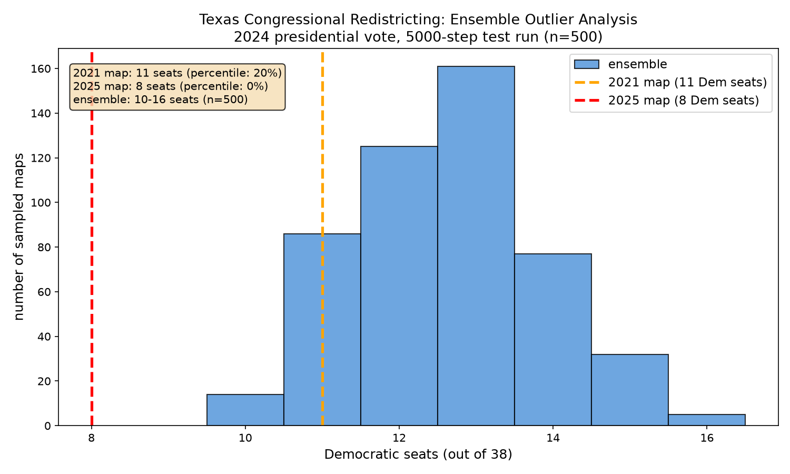
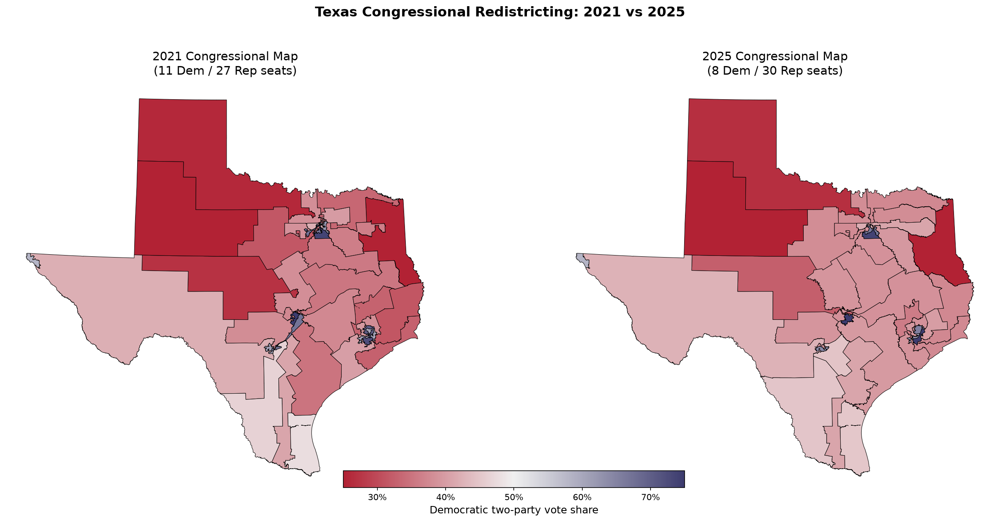

# Gerrymander Detector

Can we mathematically prove a congressional map is gerrymandered?

This project generates thousands of legally valid alternative district maps using [MCMC sampling](https://en.wikipedia.org/wiki/Markov_chain_Monte_Carlo) and checks whether the real enacted map is a statistical outlier. If the real map looks nothing like what a neutral process would produce, that's a red flag.

Built for my [PEAK Award](https://undergraduate.northeastern.edu/research/awards/peak-fellowships-overview/) research at [Northeastern University](https://www.northeastern.edu/). Texas is the proof of concept, the goal is to scale to every state.

---

## How it works

1. Pull precinct-level election and census data from the [Redistricting Data Hub](https://redistrictingdatahub.org) API
2. Build a dual graph where each precinct is a node and shared borders are edges
3. Run a Markov chain ([ReCom algorithm](https://mggg.org/samplers)) that randomly generates valid congressional maps with balanced population and contiguous districts
4. Collect metrics on each generated map (seats won, efficiency gap, mean-median difference)
5. Compare where the real enacted map falls in that distribution

If the enacted map sits outside the range of what random valid maps produce, it likely didn't come from a neutral process.

---

## Texas Results

Using 2024 presidential vote data across 9,712 precincts and 500 sampled maps:

| Map | Dem Seats | Percentile | Outlier |
|-----|-----------|------------|---------|
| 2021 enacted | 11 | 20th | No |
| 2025 enacted | 8 | **0th** | **Yes** |
| Ensemble range | 10-16 | - | - |
| Ensemble mean | 12.6 | - | - |

Not a single randomly generated valid map produced as few as 8 Democratic seats. The 2025 map, currently being challenged in [LULAC v. Abbott](https://www.democracydocket.com/cases/texas-redistricting-challenge-lulac/), sits completely outside the distribution.

### Ensemble Outlier Analysis

  

The red dashed line (2025 map) falls entirely outside the blue ensemble distribution. The orange line (2021 map) sits within range.

### District Maps — 2021 vs 2025

  

Side-by-side comparison of Texas congressional districts colored by partisan lean. Blue = Democratic, Red = Republican. Notice how blue districts in the 2021 map get broken apart in the 2025 version.

---

## Why Texas

- **New maps, little coverage.** One of the newest states to redraw district lines. Most existing gerrymandering projects haven't analyzed these maps yet.
- **Rare mid-decade redistricting.** States normally redraw every 10 years after the census. Texas redrew in 2025, [just 4 years after the last round](https://en.wikipedia.org/wiki/2025_Texas_redistricting).
- **Scale test.** 38 congressional districts makes it one of the largest and most complex states to redistrict. If the pipeline works here it works anywhere.

---

## Assumptions

- **Partisan proxy**: 2024 presidential race, following the approach in [Duchin's expert testimony](https://mggg.org/uploads/md-report.pdf) in the Pennsylvania redistricting case and the [MGGG Lab's](https://mggg.org) published work. Still just one election.
- **Constraints**: Population balance (±5%) and contiguity (every district is one connected piece). Does not enforce compactness or county preservation, which actually strengthens outlier findings since stricter rules would narrow the ensemble range further.
- **Data merge**: Precinct boundaries shifted between the 2020 census and 2024 elections. Used centroid-based spatial joins to merge population data. About 1,500 precincts ended up with zero population, likely water or uninhabited areas. Statewide total still matches the census.

---

## Project Structure

    src/
      data_prep/               data cleaning and merging
        build_texas_dataset.py
      chain/                   markov chain generation
        run_texas.py
      analysis/                outlier scoring and visualization
        score_2025_map.py
        plot_texas.py
        map_texas.py
      metrics/                 partisan and compactness metrics
    rdh_api_tool/              redistricting data hub api notebooks
    outputs/
      ensembles/               chain results (csv, not in repo)
      figures/                 plots and maps
    data/                      raw and processed shapefiles (not in repo)

---

## Stack

| Tool | Purpose |
|------|---------|
| [GerryChain](https://github.com/mggg/GerryChain) | MCMC redistricting sampling (ReCom algorithm) |
| [GeoPandas](https://geopandas.org) | Geospatial data wrangling |
| [NetworkX](https://networkx.org) | Graph construction and analysis |
| [Matplotlib](https://matplotlib.org) | Visualization |
| [Redistricting Data Hub](https://redistrictingdatahub.org) | Precinct-level election and boundary data |

---

## References

> DeFord, Duchin, & Solomon (2021). [Recombination: A Family of Markov Chains for Redistricting.](https://hdsr.mitpress.mit.edu/pub/1ds8ptxu) *Harvard Data Science Review*, 3(1).

> Chikina, Frieze, & Pegden (2017). [Assessing Significance in a Markov Chain without Mixing.](https://www.pnas.org/doi/10.1073/pnas.1617540114) *PNAS*, 114(11).

> Duchin (2018). [Outlier Analysis for Pennsylvania Congressional Redistricting.](https://mggg.org/uploads/md-report.pdf) Expert report, *League of Women Voters v. Commonwealth of Pennsylvania*.

> Becker et al. (2021). [Computational Redistricting and the Voting Rights Act.](https://www.brennancenter.org/sites/default/files/2023-11/Computational%20Redistricting%20and%20the%20Voting%20Rights%20Act%20FINAL%20PUBLISHED%20VERSION%20elj.2020.0704.pdf)

---

## Author

**Binafsha Bakhramova** — [Northeastern University](https://www.northeastern.edu/), Khoury College of Computer Sciences

PEAK Award Research. Not affiliated with any political party, campaign, or advocacy organization.

Data sourced from the [Redistricting Data Hub](https://redistrictingdatahub.org).