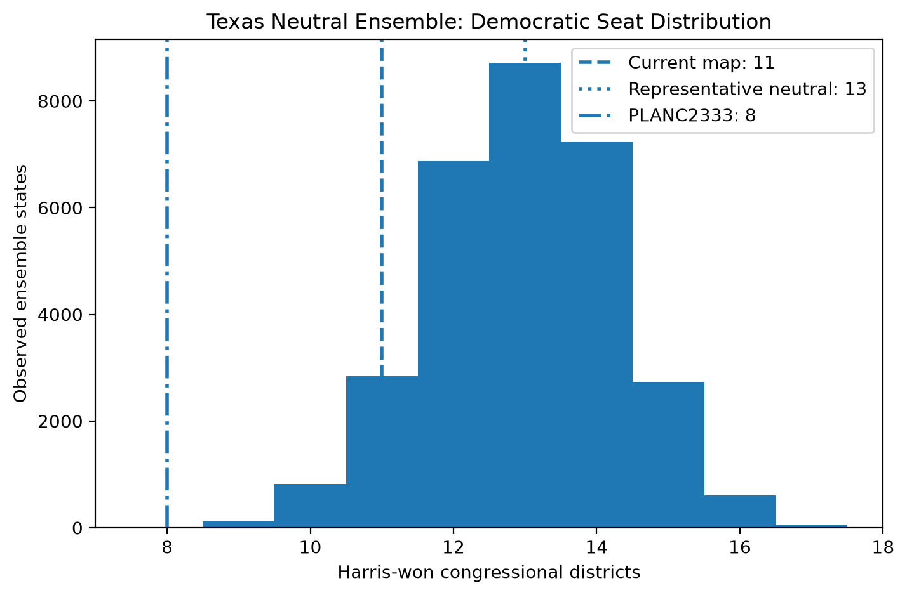
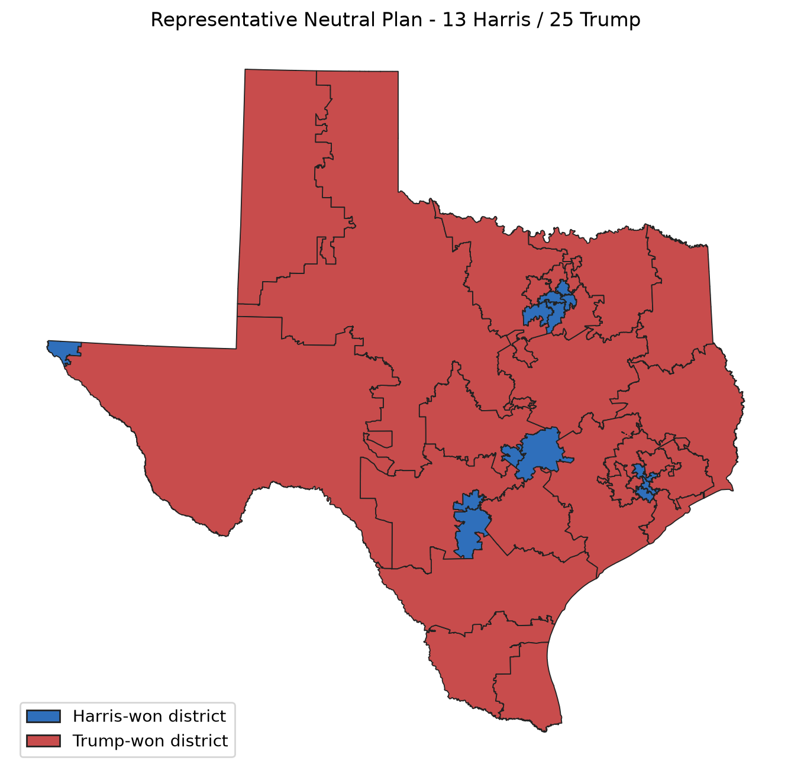
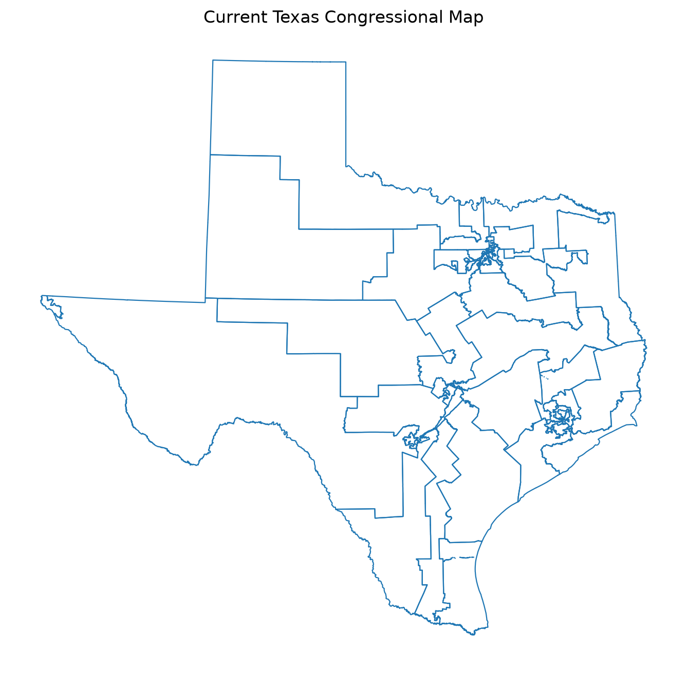
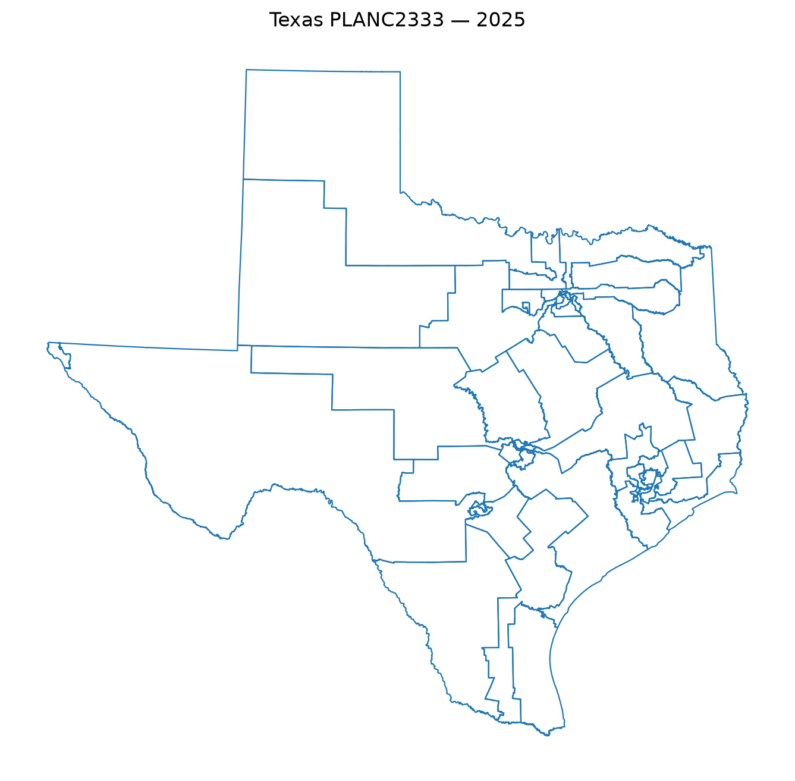

# Gerrymander Detector

[](https://python.org)
[](https://github.com/mggg/GerryChain)
[](LICENSE)
[](https://redistrictingdatahub.org)

Can we mathematically prove a congressional map is gerrymandered?

Not exactly. But we can ask whether an enacted map looks unusually extreme compared with thousands of alternative maps generated under a neutral redistricting process.

This project uses Markov chain Monte Carlo (MCMC) redistricting simulations to generate alternative congressional maps and compare enacted plans against the resulting distribution.

Built for my [PEAK Award](https://undergraduate.northeastern.edu/research/awards/peak-fellowships-overview/) research at [Northeastern University](https://www.northeastern.edu/).

Texas is the first full case study, with the long-term goal of extending the pipeline to additional states.

---

## How It Works

1. Build a validated geographic dataset using election, Census, and official district-assignment data.
2. Represent the state as a graph where geographic units are nodes and shared borders create edges.
3. Run a Markov chain using the [ReCom algorithm](https://mggg.org/samplers) to generate alternative congressional plans.
4. Require every generated plan to contain contiguous districts and remain within +/-0.1% of ideal district population.
5. Measure each plan using partisan seat count, efficiency gap, mean-median difference, and other diagnostics.
6. Compare enacted maps with the observed ensemble distribution.
7. Evaluate burn-in sensitivity, autocorrelation, effective sample size, and chain stability before interpreting the results.

The ensemble shows how unusual an enacted plan is under the modeled neutral process.

It does not directly prove legislative intent, and autocorrelated Markov-chain states are not treated as independent observations.

---

## Texas Results

The final Texas analysis uses:

- 9,712 validated geographic units
- 38 congressional districts
- 29,145,505 total population
- 2024 Harris-Trump presidential vote as the partisan proxy
- 30,000 post-burn-in ReCom states
- +/-0.1% maximum population tolerance

### Seat Results

| Map | Harris-won districts | Position in observed ensemble |
|---|---:|---|
| Current Texas map | 11 | 12.607% lower tail |
| Representative neutral plan | 13 | Near ensemble center |
| PLANC2333 (2025) | 8 | Below every observed state |
| Ensemble range | 9-17 | - |
| Ensemble mean | 12.973 | - |
| Ensemble median | 13 | - |

No retained post-burn-in ensemble state produced as few as 8 Harris-won congressional districts.

PLANC2333 therefore falls below the observed seat-count range of the 30,000-state ensemble.

Because successive ReCom states are autocorrelated, this result should be interpreted as an observed ensemble result, not as a literal probability of zero.

---

## Ensemble Outlier Analysis

<p align="center">
  
</p>

The neutral ensemble ranges from 9 to 17 Harris-won districts.

The current Texas map produces 11 Harris-won districts and remains within the observed seat distribution.

PLANC2333 produces 8, below every retained state in the ensemble.

---

## Representative Neutral Plan

<p align="center">
  
</p>

The representative neutral plan is chain step 26,999.

It contains:

- 13 Harris-won districts
- efficiency gap: -0.049588
- mean-median difference: +0.008427
- maximum population deviation: 0.098043%

The plan was selected from reconstructable ensemble states with the median seat count and values close to the ensemble center for efficiency gap, mean-median difference, and cut edges.

Blue districts were won by Harris in the 2024 presidential vote.

Red districts were won by Trump.

---

## Current Texas Congressional Map

<p align="center">
  
</p>

The current congressional map contains 11 Harris-won districts.

Its seat count is on the lower side of the ensemble but remains within the observed 9-17 district range.

---

## PLANC2333 - 2025 Texas Congressional Plan

<p align="center">
  
</p>

PLANC2333 contains 8 Harris-won districts.

For the 2025 plan, district population and partisan results are calculated using exact Census-block district assignments rather than assigning entire precincts to districts by centroid.

This allows split precincts to be scored using their actual block-level congressional assignments.

---

## Additional Partisan Metrics

### Current Texas Map

- Harris-won districts: 11
- efficiency gap: -0.130938
- mean-median difference: -0.057243
- maximum population deviation: 0.052416%
- seat-count lower tail: 12.607%
- efficiency-gap lower tail: 0.517%
- mean-median lower tail: 0.000% of observed states

### Representative Neutral Plan

- Harris-won districts: 13
- efficiency gap: -0.049588
- mean-median difference: +0.008427
- maximum population deviation: 0.098043%

### PLANC2333

- Harris-won districts: 8
- efficiency gap: -0.193900
- mean-median difference: -0.052861
- maximum population deviation: approximately 0.000127%

For lower-tail values reported as 0.000%, the interpretation is that no retained ensemble state was as extreme or more extreme in that direction.

It does not imply that the true probability is exactly zero.

---

## Ensemble Diagnostics

The final post-burn-in ensemble contains 30,000 states spanning global chain steps 700 through 30,699.

### Ensemble Summary

- retained states: 30,000
- unique exact plans: 29,301
- duplicate states: 699
- Harris-won district range: 9-17
- mean Harris-won districts: 12.973
- median Harris-won districts: 13
- maximum observed population deviation: 0.099998%

### Approximate Effective Sample Sizes

- seat count: 98
- efficiency gap: 92
- mean-median difference: 118
- cut edges: 162

The chain is strongly autocorrelated.

Therefore, 30,000 retained states should not be interpreted as 30,000 statistically independent observations.

Burn-in sensitivity checks from 500 through 900 steps produced very similar ensemble averages.

First-half and second-half comparisons show some remaining chain drift, so a future publication-oriented extension should run multiple independent chains with different random seeds and compare convergence across chains.

---

## Seat Distribution

| Harris-won districts | Observed states | Share |
|---:|---:|---:|
| 9 | 116 | 0.39% |
| 10 | 822 | 2.74% |
| 11 | 2,844 | 9.48% |
| 12 | 6,878 | 22.93% |
| 13 | 8,721 | 29.07% |
| 14 | 7,235 | 24.12% |
| 15 | 2,732 | 9.11% |
| 16 | 607 | 2.02% |
| 17 | 45 | 0.15% |

The modal and median outcome is 13 Harris-won districts.

---

## Data Construction

The final Texas pipeline avoids the earlier precinct-centroid population approximation.

### Population

Census-block population is joined to official geographic and district identifiers and then aggregated into the validated 2024 precinct geography.

The final precinct dataset contains:

- 9,712 geographic units
- 322 zero-population units
- 29,145,505 total population
- 38 current congressional districts

The statewide population total is preserved exactly.

### Election Data

The partisan proxy is the 2024 presidential election.

Statewide totals in the validated dataset:

- Harris: 4,835,134 votes
- Trump: 6,393,403 votes

### PLANC2333

The 2025 congressional benchmark is scored using exact block-level `C2333` assignments.

This avoids forcing split precincts into a single congressional district.

---

## Model Assumptions

Every redistricting analysis depends on modeling choices.

### Population and Contiguity

Every generated plan must:

- contain exactly 38 congressional districts
- keep every district contiguous
- remain within +/-0.1% of ideal district population

### Partisan Proxy

The current analysis uses the 2024 Harris-Trump presidential election as the partisan measure.

This provides a consistent statewide election for comparing all districts.

A stronger future analysis could repeat the comparison across multiple statewide elections.

### Constraints Not Yet Modeled

The current ensemble does not explicitly impose:

- county-preservation rules
- municipality-preservation rules
- compactness thresholds
- Voting Rights Act constraints
- communities-of-interest rules

The results therefore describe the specific neutral model implemented here, not every legally or politically possible redistricting process.

---

## Validation

The final Texas pipeline was checked for:

- 9,712 validated geographic units
- 38 current congressional districts
- exact statewide population total
- exact statewide Harris vote total
- exact statewide Trump vote total
- 30,000 post-burn-in states
- continuous global chain steps 700-30,699
- 38 districts in the representative neutral plan
- no missing representative-plan assignments
- 38 PLANC2333 districts
- no missing PLANC2333 block assignments
- agreement between manual and GerryChain efficiency-gap calculations
- agreement between manual and GerryChain mean-median calculations

All final validation checks passed.

---

## Why Texas

- **Recent redistricting.** Texas adopted a new congressional plan in 2025.
- **Mid-decade redistricting.** The state redrew congressional boundaries between decennial censuses.
- **Large-scale test.** Texas has 38 congressional districts, making it a useful stress test for the pipeline.
- **Rich public data.** Census, election, and official redistricting data make detailed validation possible.

Texas serves as the proof of concept for extending the methodology to additional states.

---

## Project Structure

```text
src/
  data_prep/
    build_texas_master.py
    build_texas_precincts.py

  chain/
    run_ensemble.py

  analysis/
    analyze_texas_ensemble.py
    analyze_thinning.py
    make_texas_final_figures.py

  metrics/

  legacy/
    map_texas.py
    plot_texas.py
    score_2025_map.py

outputs/
  ensembles/
  analysis/
  figures/

docs/
  outputs/
    figures/

data/
  raw/
  processed/
```

Legacy Texas scripts based on the earlier methodology are retained under `src/legacy/` and are not part of the final validated pipeline.

---

## Reproducibility

The general ensemble runner is:

`src/chain/run_ensemble.py`

The final Texas analysis is:

`src/analysis/analyze_texas_ensemble.py`

Empirical thinning diagnostics are implemented in:

`src/analysis/analyze_thinning.py`

Final figures are generated by:

`src/analysis/make_texas_final_figures.py`

The validated Texas chain was run with:

- Python 3.12
- GerryChain 0.3.2
- GeoPandas
- Pandas
- NetworkX
- SciPy
- Matplotlib

For reproducible checkpoint continuation of the validated chain:

```powershell
$env:PYTHONHASHSEED = "0"
```

---

## Stack

| Tool | Purpose |
|---|---|
| [GerryChain](https://github.com/mggg/GerryChain) | ReCom Markov-chain redistricting |
| [GeoPandas](https://geopandas.org) | Geospatial data processing |
| [Pandas](https://pandas.pydata.org) | Tabular analysis |
| [NetworkX](https://networkx.org) | Graph construction and validation |
| [SciPy](https://scipy.org) | Statistical analysis |
| [Matplotlib](https://matplotlib.org) | Visualization |
| [Redistricting Data Hub](https://redistrictingdatahub.org) | Election and geographic data |

---

## References

DeFord, D., Duchin, M., and Solomon, J. (2021). [Recombination: A Family of Markov Chains for Redistricting](https://hdsr.mitpress.mit.edu/pub/1ds8ptxu). *Harvard Data Science Review*, 3(1).

Chikina, M., Frieze, A., and Pegden, W. (2017). [Assessing Significance in a Markov Chain without Mixing](https://www.pnas.org/doi/10.1073/pnas.1617540114). *PNAS*, 114(11).

Duchin, M. (2018). [Outlier Analysis for Pennsylvania Congressional Redistricting](https://mggg.org/uploads/md-report.pdf). Expert report, *League of Women Voters v. Commonwealth of Pennsylvania*.

Becker et al. (2021). [Computational Redistricting and the Voting Rights Act](https://www.brennancenter.org/sites/default/files/2023-11/Computational%20Redistricting%20and%20the%20Voting%20Rights%20Act%20FINAL%20PUBLISHED%20VERSION%20elj.2020.0704.pdf).

---

## Author

**Binafsha Bakhramova**

[D'Amore-McKim School of Business](https://damore-mckim.northeastern.edu/)  
[Northeastern University](https://www.northeastern.edu/)

PEAK Award Research.

Not affiliated with any political party, campaign, or advocacy organization.

Data sourced in part from the [Redistricting Data Hub](https://redistrictingdatahub.org).
